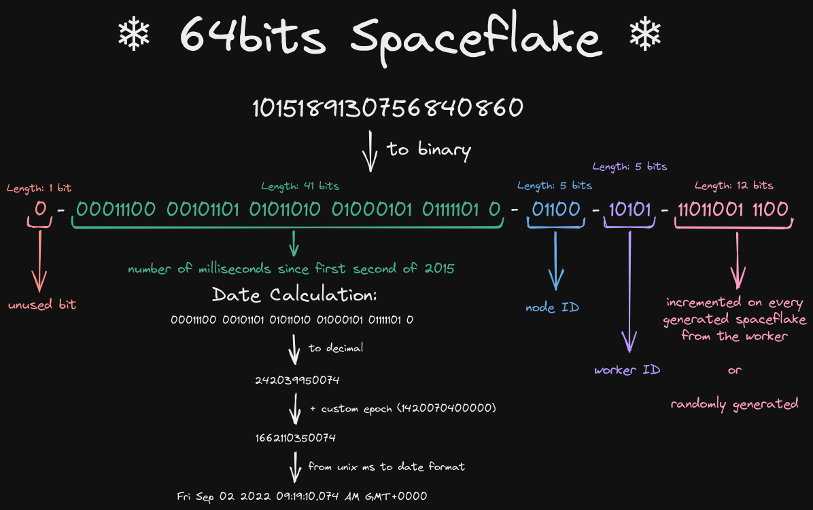
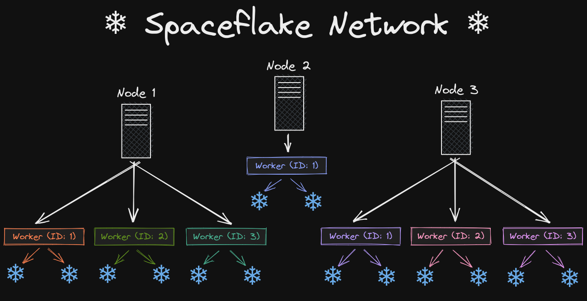

# ❄ Spaceflake ❄

[](https://discord.gg/xj6y5ZaTMr) [](https://pkg.go.dev/github.com/kkrypt0nn/spaceflake)   

A distributed generator to create unique IDs with ease; inspired by [Twitter's Snowflake](https://github.com/twitter-archive/snowflake/tree/snowflake-2010). Blog post about this project can be found [here](https://krypton.ninja/2022/11/08/Generating-unique-IDs-with-the-Snowflake-algorithm/).

## What is a Snowflake?
Apart from being a crystal of snow, a snowflake is a form of unique identifier which is being used in distributed computing. It has specific parts and is 64 bits long in binary. I simply named my type of snowflake, a **Spaceflake**, as it does not compose of the same parts of a Twitter Snowflake and is being used for [Project Absence](https://github.com/ProjectAbsence) and other projects of myself.

### Structure
A Spaceflake is structured like the following:


## Spaceflake Network
A Spaceflake Network is a very basic concept where you have multiple **independent nodes** that themselves consist of multiple workers. These workers are the ones that can generate a Spaceflake.

Ideally a Spaceflake Network represents your entire application, or company. Each node represents a single server or application within the company, and each worker represents a single process which can generate a Spaceflake for a specific purpose. This way you can easily identify where a Spaceflake was generated by looking at its node ID and worker ID.

In the end you are free to use them as you wish, just make sure you use these nodes and workers to be able to identify the Spaceflake.

### Example Network
An example network is structured like the following

We can consider **Node 1** as being the API/backend of your application. The **Worker (ID: 1)** would be responsible for generating Spaceflakes for user IDs. The **Worker (ID: 2)** would be responsible for generating Spaceflakes for blog post IDs.

The **Node 2** might be responsible for the logs of your components, and the log ID generated would be generated by the **Worker (ID: 1)** from that node.

## Some Statistics
* A Spaceflake network can hold up to **31 nodes** and **31 workers per node**. So you can have up to **961 workers in total** in a single network that will generate Spaceflakes.
* A **single worker** can generate up to **4095 Spaceflakes per millisecond**.
* A **single node** with **31 workers** can generate up to **126'945 Spaceflakes per millisecond**.
* A **single network** with **31 nodes** and **31 workers per node** can generate up to **3'935'295 Spaceflakes per millisecond**.

## Example
A very basic example on using the library is by using the generator **without** nodes and worker objects, though this is not recommended and using nodes and workers is better.
```go
package main

import (
	"fmt"

	"github.com/kkrypt0nn/spaceflake"
)

func main() {
	node := spaceflake.NewNode(1)
	worker := node.NewWorker()
	sf, err := worker.GenerateSpaceflake()
	if err != nil {
		panic(err)
	}
	fmt.Println(sf.Decompose()) // map[id:<Spaceflake> nodeID:1 sequence:1 time:<timestamp> workerID:1]
}
```
Some other examples:
- [Bulk generation](examples/bulk/bulk.go): Generate multiple Spaceflakes at once.
- [Generation with nodes and workers](examples/node_workers/node_workers.go): Generate a Spaceflake by creating a node and worker object.
- [Generation with settings](examples/generate/generate.go): Generate a Spaceflakes with specific settings *(Not recommended, consider using nodes and workers)*

## Installation

If you want to use this library for one of your projects, you can install it like any other Go library

```shell
go get github.com/kkrypt0nn/spaceflake
```

## ⚠️ Disclaimers
### Spaceflakes are Big Numbers
> 📜 TL;DR: If you use Spaceflakes in an API, return them as a **string**, not a number.

Since Spaceflakes are big numbers, it is most likely that if you use them for an API that returns a JSON you will need to return the Spaceflake as a string, otherwise you will lose some precision and it will alter the value of, most likely, the sequence of the Spaceflake. Example:
```json
{
	"id": 144328692659220480 // ID actually generated in Go: 144328692659220481
}
```
The difference between the two numbers is not that big in the example above, though it plays a big role. The difference is not always the same, so you can't subtract. JavaScript, for example, sees no difference between both of these numbers:
```js
console.log(144328692659220480 == 144328692659220481) // true
```

You can get the Spaceflake as a string and convert to a `uint64` data type, when needed, in your Go code using the following:
```Go
spaceflakeID := "144328692659220481" // Will be the value returned by the API
id, _ := strconv.ParseUint(spaceflakeID, 10, 64)
sequence := spaceflake.ParseSequence(id)
```
### "Random" Sequence Based on Time
> 📜 TL;DR: The sequence is not truly random, it is based on the time; and if you generate lots of Spaceflake in the same millisecond, there is a chance that two Spaceflakes will result to the same. Using **nodes and workers** is highly recommended.

When generating lots of Spaceflakes in a really short time and without using a worker, there is a chance that the same ID is generated twice. Consider making your program sleep for 1 millisecond or test around between the generations, example:
```go
func GenerateLotsOfSpaceflakes() {
	spaceflakes := map[uint64]*Spaceflake{}
	settings := NewGeneratorSettings()

	for i := 0; i < 1000; i++ {
		sf, err := Generate(settings)
		if err != nil {
			t.Error(err)
		}
		if spaceflakes[sf.ID()] != nil {
			panic(err)
		}
		spaceflakes[sf.ID()] = sf

		// When using random there is a chance that the sequence will be twice the same due to Go's speed, hence using a worker is better. We wait a millisecond to make sure it's different.
		time.Sleep(1 * time.Millisecond)
	}
}
```
In that case it is recommended to use the workers, as they do not use a random value as a sequence number, but an incrementing value. Another option would be to use the [bulk generator](examples/bulk/bulk.go) to create lots of **unique** Spaceflakes at once.

As a last resort you can replace the sequence with a better random number generator using the following:
```go
settings.Sequence = ... // Replace with your number generator
```

## License

This library was made with 💜 by Krypton and is under the [MIT](LICENSE.md) license.
