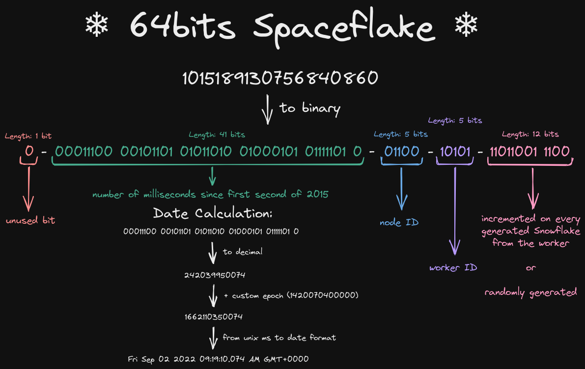

# ❄ Spaceflake ❄

[](https://pkg.go.dev/github.com/kkrypt0nn/spaceflake)   

A generator to create unique IDs with ease; inspired by [Twitter's Snowflake](https://github.com/twitter-archive/snowflake/tree/snowflake-2010).

## What is a Snowflake?

Apart from being a crystal of snow, a snowflake is a form of unique identifier which is being used in distributed computing. It has a specific parts and is 64 bits long in binary. I simply named my type of snowflake, a **Spaceflake**, as it does not compose of the same parts of a Twitter Snowflake and is being used for [Spacehut](https://github.com/spacehutapp) and other projects of myself.

A Spaceflake is structured like the following



## Example
A very basic example on using the library would be the following
```go
package main

import (
	"fmt"

	"github.com/kkrypt0nn/spaceflake"
)

func main() {
	settings := spaceflake.NewGeneratorSettings()
	sf, err := spaceflake.Generate(settings)
	if err != nil {
		panic(err)
	}
	fmt.Println(sf.Decompose()) // map[id:<spaceflake> nodeId:0 sequence:<random> time:<timestamp> workerId:0]
}
```
For different examples you can see the normal generation example [here](examples/generate/generate.go) or if you want to use workers and nodes you can see the [worker example](examples/node_workers/node_workers.go).

## Installation

If you want to use this library for one of your projects, you can install it like any other Go library

```shell
go get github.com/kkrypt0nn/spaceflake
```

## ⚠️ Disclaimer
When generating lots of spaceflakes in a really short time and without using a worker, there is a chance that the same ID is generated twice. Consider making your program sleep for 1 millisecond or test around between the generations, example:
```go
func GenerateLotsOfSpaceflakes() {
	spaceflakes := map[uint64]*Spaceflake{}
	settings := NewGeneratorSettings()

	for i := 0; i < 1000; i++ {
		sf, err := Generate(settings)
		if err != nil {
			t.Error(err)
		}
		if spaceflakes[sf.ID()] != nil {
			panic(err)
		}
		spaceflakes[sf.ID()] = sf

		// When using random there is a chance that the sequence will be twice the same due to Go's speed, hence using a worker is better. We wait a millisecond to make sure it's different.
		time.Sleep(1 * time.Millisecond)
	}
}
```
In that case it is recommended to use the workers, as they do not use a random value as a sequence number, but an incrementing value.

Otherwise you can replace the sequence with a better random number generator using the following:
```go
settings.Sequence = ... // Replace with your number generator
```

## License

This library was made with 💜 by Krypton and is under the [GPL v3](LICENSE.md) license.
